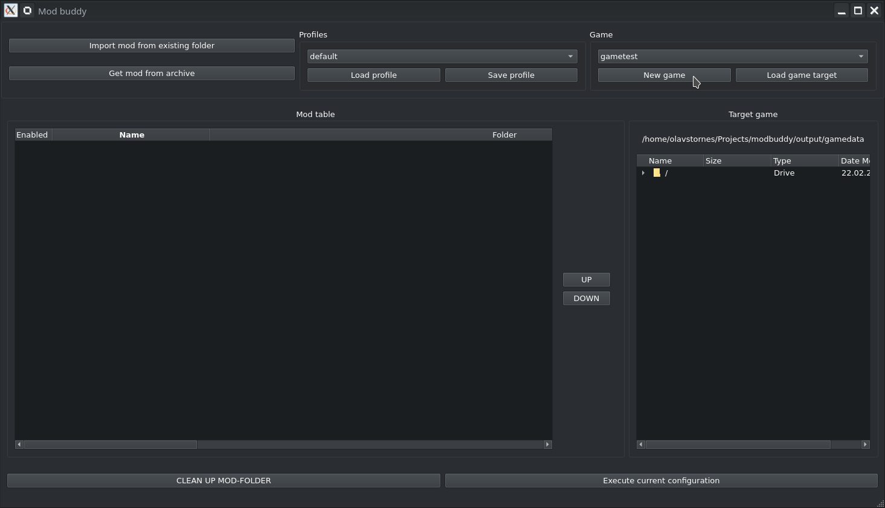
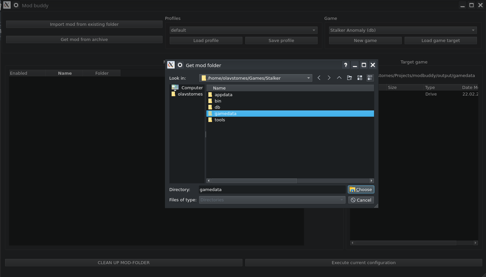

# Mod buddy

Mod buddy is a mod manager created with extensibillity in mind

## Intro
After attempting to mod Stalker Anomaly, i figured i missed a decent mod manager on Linux.

## Features

- User-centric in where the content of a mod actually lies ([Explanation](#Usage))
- Applied mods are hard linked, saving space
- Support for an arbitrary amount of games
- Mod presets
- Prioritize mod order

### Future dreams
- Conflict detection
- Revert a modified folder to its unmodded state
- More user friendlyness
- Use relative paths on mod settings

## Cases

To further understand why this exists in the first place, I have some examples where the use case may be clear:

- Texture packs with optional patches

This is one use case i find practical. Rather than merging all the patches i want, i can manage them through Mod buddy by importing each patch as a separate mod.

![[Pasted image 20210303211214.png]]

- STALKER Anomaly
Stalker anomaly has a big variety of addons/mods, and as a lot of the mods overlap with varying grade of compabillity. This workflow is easily manageable as well. Since not all addons have the same file structure ('ROOT/gamedata'), Mod buddy is developed to handle such cases as well.

## Usage

### Installation
Requirements can be retrieved with `pip install -r requirements.txt`

### Set up a game folder

- First you need to set up a destination folder. This is done with the control panel on the upper right ("New Game"). Here you will choose which folder the mods will reside.

### Presets
- When setting up a new game, a default profile is created as well (controls at the top middle). Should you need multiple configurations, this is where you can control this.

### Add mods
Lastly, you add mods via the "Add mods"-group to the top left.

You can add mods from two different ways:
- Add mod from archive: Extract target archive to a folder inside Mod buddy, where you then can choose the folder inside
- Add mod from folder: Choose a folder which contains a mod 
	- This is intended for mods that have multiple patches (such as the texture pack mentioned above) or when the user didn't use the above mentioned button.

## Disclaimer
Before you want to try this out: I'm not a UX-designer, a QT-developer nor a cat. This is a personal project which i have found a practical use for. 
